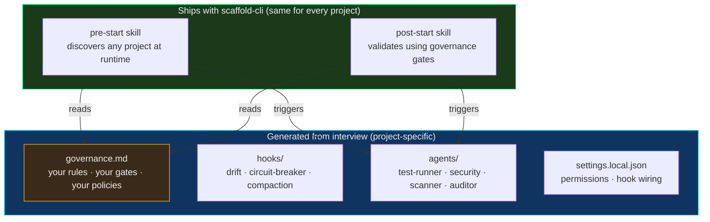
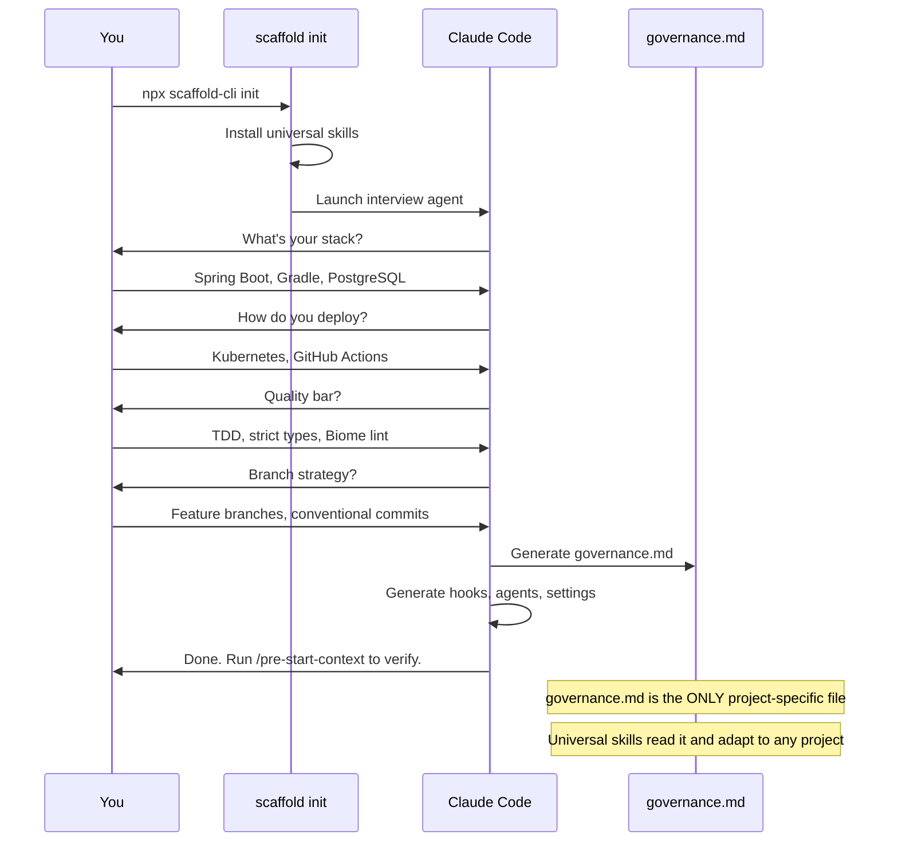
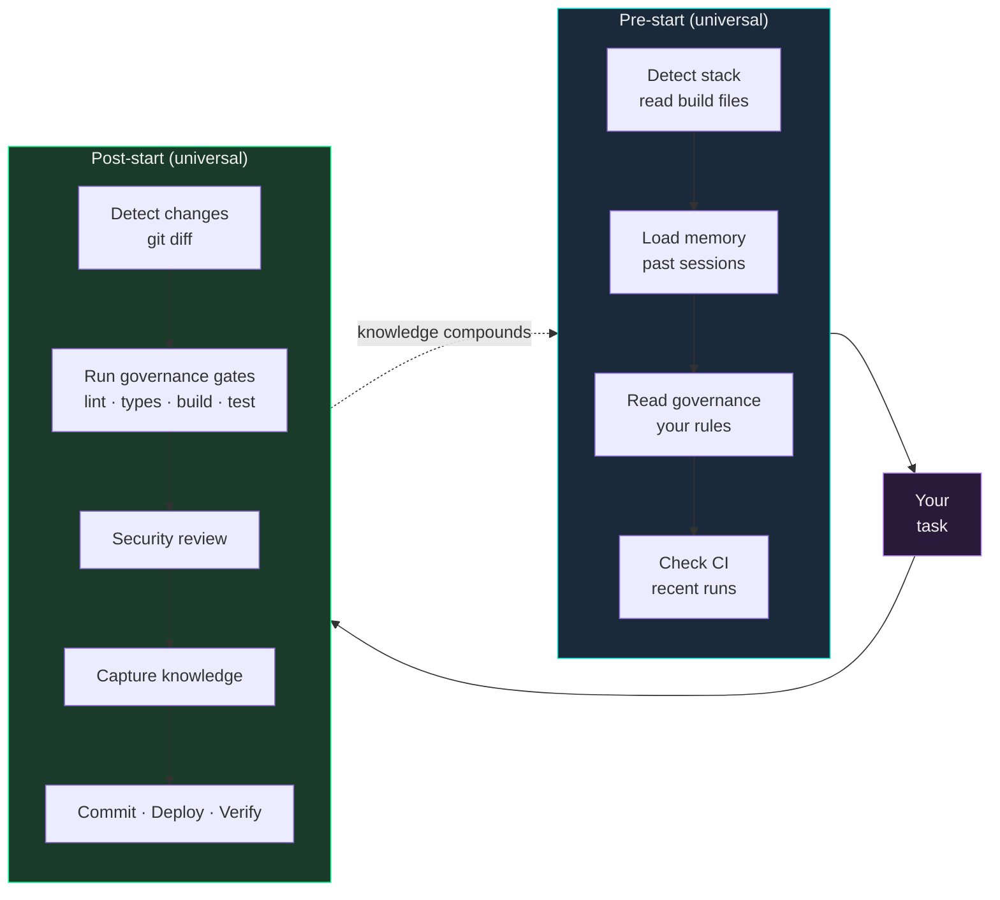
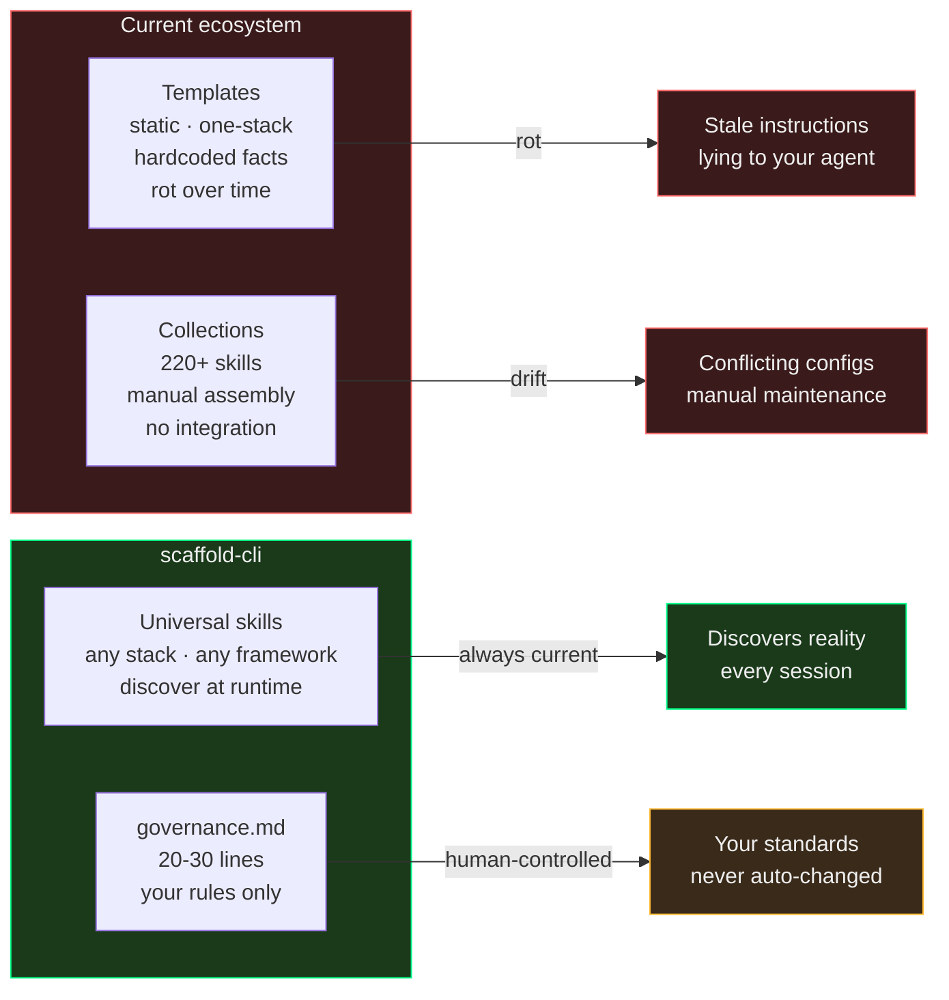

# scaffold-cli

**The runtime layer for Claude Code. One config file. Self-maintaining forever.**

scaffold-cli installs a universal intelligence layer that works with any project — any language, any framework, any deployment target. It discovers your project at runtime instead of hardcoding facts about it. The only project-specific file is `governance.md` — your rules, your quality bar, your policies — generated from a one-time interview.

```bash
npx scaffold-cli init
```

---

## Architecture



**The skills are universal.** They don't know your stack — they discover it. They don't know your gates — they read them from `governance.md`. Add a service, change your CI, upgrade your framework — the skills adapt. Nothing to update.

**The governance is yours.** 20-30 lines of policy. Your quality bar. Your branch strategy. Your security rules. Changes only when you decide.

---

## How It Works



---

## The Session Loop

Once scaffolded, every session self-improves:



The skills don't hardcode anything. They discover the project shape, read your governance rules, and apply them. Each session builds on the last.

---

## Quick Start

```bash
# Install and run
npx scaffold-cli init

# Or install globally
npm install -g scaffold-cli
scaffold init

# Or from inside Claude Code
/scaffold-project
```

After the interview:

```bash
# Verify everything is in place
scaffold check
```

```
  Core:
    ✓ Pre-start skill (universal)
    ✓ Post-start skill (universal)
    ✓ Governance rules
    ✓ Drift detector hook
    ✓ Circuit breaker hook
    ✓ Test runner agent
    ✓ Security reviewer agent
    ✓ CI playbook
    ✓ Settings with hooks

  9/9 core files present.
  Infrastructure complete.
```

---

## governance.md

The only file you maintain. Everything else is universal or generated.

```markdown
# Governance — orderflow

## Identity
- Project: orderflow
- Description: Enterprise order management system

## Gates (run in order, stop on failure)
### Frontend
- npx biome check --diagnostic-level=error
- npx tsc --noEmit
- npm run build
- npm test

### Backend
- ./gradlew test --console=plain -q --no-daemon --stacktrace
- ./gradlew check --console=plain -q --no-daemon --stacktrace

## Branch Strategy
- Feature branches (feat/, fix/, refactor/, chore/)
- Conventional commits
- Auto-commit after all gates pass

## Security
- JWT with Spring Security (algorithm pinning)
- Rate limiting on all public endpoints (Bucket4j)
- No hardcoded secrets

## Deployment
- Kubernetes, GitHub Actions CI
- Rolling update strategy
- Verify: kubectl rollout status after push
```

That's it. The universal skills read this and know exactly what to enforce, what to check, and how to deploy. Change a gate command — it takes effect next session. Add a security rule — enforced immediately.

---

## What Ships vs What's Generated

| Component | Source | Maintains itself? |
|-----------|--------|------------------|
| Pre-start skill | **Ships universal** | Yes — discovers project at runtime |
| Post-start skill | **Ships universal** | Yes — reads governance for gates |
| `governance.md` | **Generated from interview** | No — you maintain it (20-30 lines) |
| Hook scripts | **Generated for your tools** | Yes — drift detector adapts |
| Agent definitions | **Generated for your stack** | Yes — read governance for commands |
| Settings | **Generated** | Yes — RTK wildcards cover new tools |
| CI playbook | **Generated template** | You add entries as failures are found |

---

## Why This Exists



Templates hardcode facts. Facts change. Templates rot.

scaffold-cli discovers facts at runtime. The only thing hardcoded is your quality bar — and that changes only when you change it.

---

## Hooks

All hooks are **deterministic** (100% reliable) and **zero token cost**.

| Hook | Event | What it does |
|------|-------|-------------|
| Drift detector | SessionStart | Checks if key project files still exist |
| Circuit breaker | PostToolUseFailure | Warns at 3 failures, alerts at 5 |
| Pre-compact | PreCompact | Snapshots state to MemStack before compaction |
| Post-compact | PostCompact | Restores context from MemStack after compaction |
| Auto-format | PostToolUse | Runs your formatter after every edit |

Compaction hooks are only generated if MemStack is enabled.

---

## Agents

All agents run in **isolated worktrees** (no edit conflicts).

| Agent | Model | Purpose |
|-------|-------|---------|
| test-runner | Sonnet | Runs your test suite in background, reports failures |
| security-reviewer | Opus | Reviews diffs for vulnerabilities (read-only) |
| dependency-scanner | Sonnet | Checks for vulnerable/outdated packages |
| skill-auditor | Sonnet | Verifies infrastructure files are intact |

---

## Roadmap

- [x] Universal pre-start and post-start skills
- [x] Interview-driven governance generation
- [x] CLI (`scaffold init`, `scaffold check`, `scaffold install`)
- [ ] `scaffold analyze` — reads existing project, generates governance without interview
- [ ] `scaffold diff` — compares current governance against codebase reality
- [ ] `scaffold upgrade` — updates universal skills when scaffold-cli releases new version
- [ ] Published npm package
- [ ] Test suite across sample projects (Spring Boot, Next.js, Python, Go, Rust)

---

## License

MIT

---

*Built by [WhitehatD](https://github.com/WhitehatD)*
