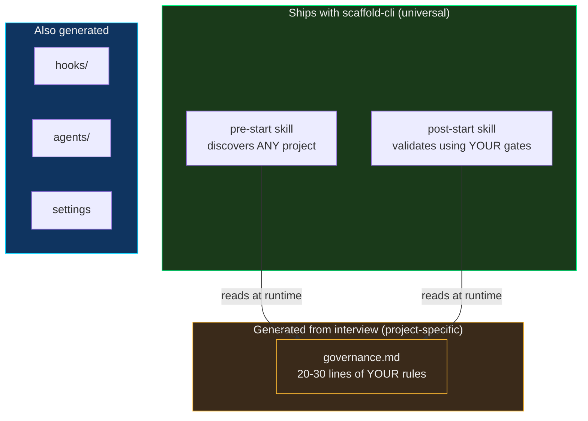
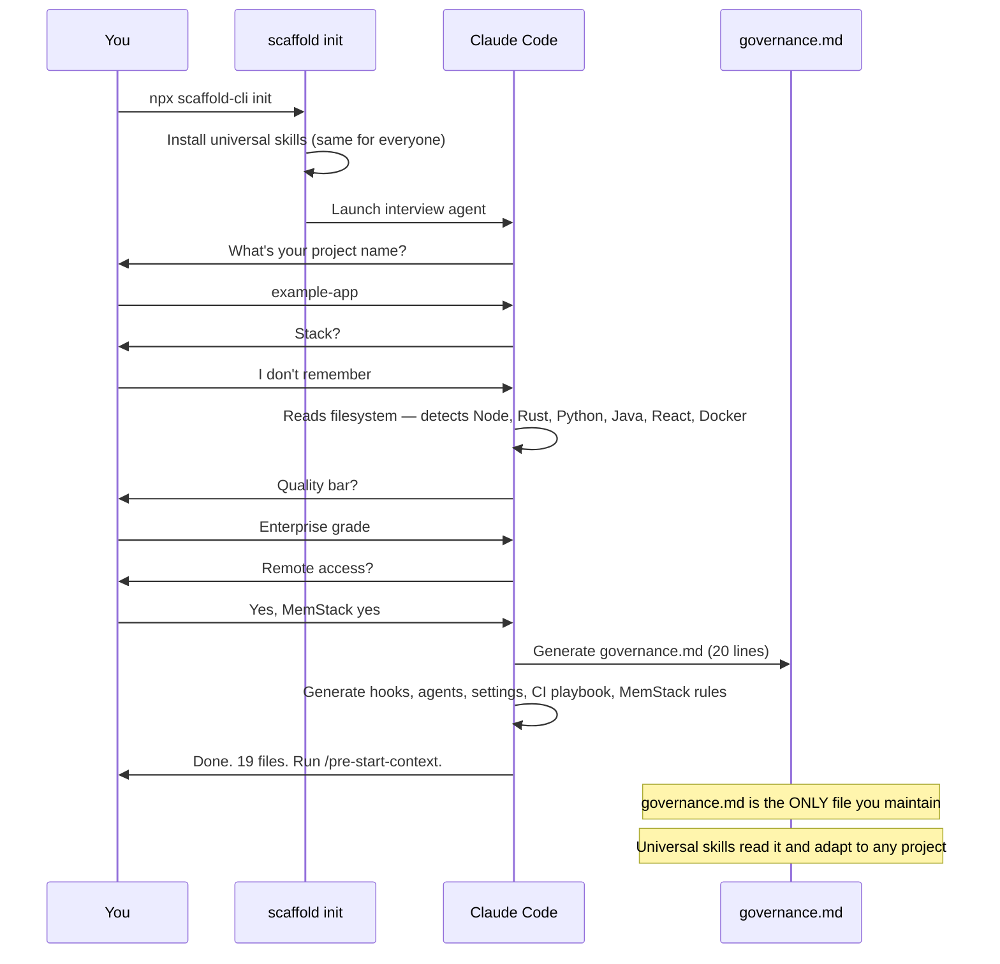
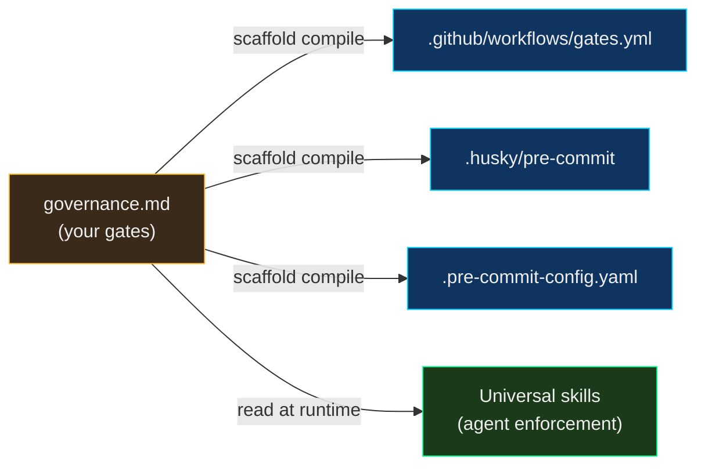
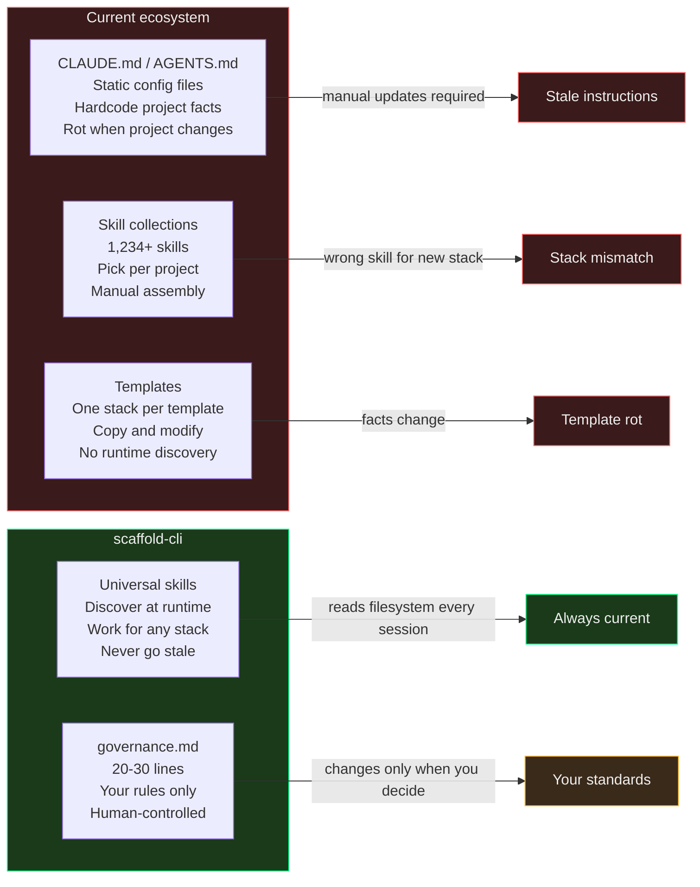
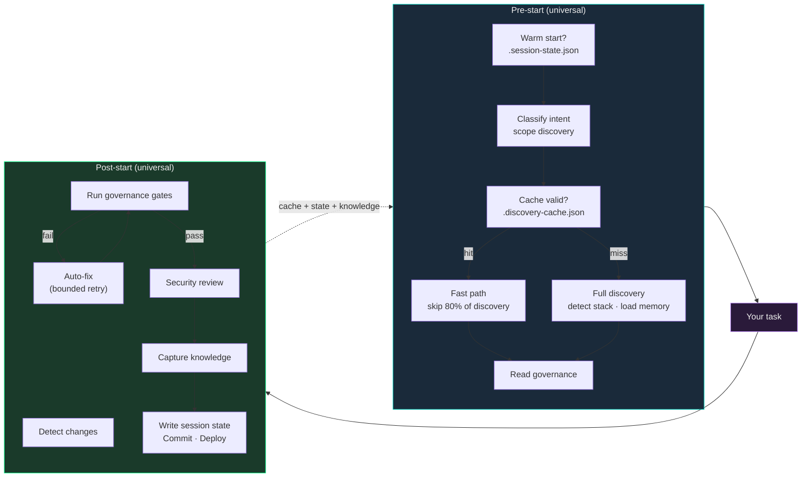

# scaffold-cli

**The infrastructure layer for AI coding agents. One config file. Works on any project. Self-maintaining forever.**

Every AI coding setup today is static — CLAUDE.md files, AGENTS.md configs, per-project templates, skill collections. They hardcode facts about your project. Facts change. Instructions rot. You maintain them or they lie to your agent.

scaffold-cli inverts this. It ships **universal skills** that discover any project at runtime — any language, any framework, any deployment target — and reads your rules from a single `governance.md` file. The skills are the engine. The governance is the config. The engine never goes stale because it reads the filesystem. The config is 20-30 lines you maintain.

```bash
npx scaffold-cli init
```

---

## Proven in Production

Not on demos. On real systems, in production, shipping to real infrastructure.

| Project | Stack | Services | Deployment | Result |
|---|---|---|---|---|
| **example-app** | Full-stack | Monolith | Docker | Full-stack governance generated |
| **example-app** | Multi-service | Services | Kubernetes | Multi-level governance hierarchy |
| **example-app** | Multi-language | Services | Docker Compose | Multiple languages detected, gates generated |
| **scaffold-cli** | Node.js CLI | Single module | npm (future) | Scaffolds itself — full dogfooding |

The same universal skills — written once, never modified per project — discovered multiple projects across varied stacks. Zero project-specific instructions in the skills. They discovered everything.

---

## The Architecture



The skills ship once and work forever. They don't know your stack — they discover it. They don't know your gates — they read them from governance.md. Add a service, change your CI, switch frameworks — the skills adapt. Nothing to update.

### The Core Insight: Discovery vs Governance

Every other tool in this space mixes "how to find things" with "what to enforce." scaffold-cli separates them cleanly:

- **Discovery** (universal skills) — reads the filesystem, detects runtimes, maps architecture, finds configs. Works on any project without modification.
- **Governance** (your governance.md) — defines YOUR rules: quality gates, security requirements, branch strategy, deployment pipeline. Changes only when YOU change it.

The skills handle discovery. governance.md handles governance. The skills never go stale because they re-discover every session. The governance never goes stale because it's your standards, not your file paths.

---

## How It Works



The agent adapts to your answers. When you say "I don't remember" — it reads the filesystem and figures it out. When you say "enterprise grade" — it picks the strictest gates available for your stack.

---

## Quick Start

```bash
npx scaffold-cli init       # Interview → generate governance + hooks + agents
npx scaffold-cli check      # Verify infrastructure
npx scaffold-cli install    # Install agent globally for /scaffold-project
npx scaffold-cli compile    # Compile governance → CI + git hooks
```

After scaffolding, in any Claude Code session:
```bash
/pre-start-context           # Discovers project, loads governance, ready to work
# ... do your task ...
/post-start-validation       # Validates, captures knowledge, commits, deploys
```

---

## governance.md

The only file you maintain. 20-30 lines. Everything else is universal.

```markdown
# Governance — example-app

## Identity
- Project: example-app
- Description: Example project using crag

## Gates (run in order, stop on failure)
### Frontend
- npx eslint frontend/ --max-warnings 0
- cd frontend && npx vite build

### Backend
- node --check scripts/server.js scripts/worker.js scripts/queue.js
- cargo clippy --manifest-path api/Cargo.toml
- cargo test --manifest-path api/Cargo.toml

### Infrastructure
- docker compose config --quiet

## Branch Strategy
- Trunk-based, conventional commits
- Auto-commit after all gates pass

## Security
- No hardcoded secrets
- No hardcoded secrets or API keys in source
```

Change a gate → takes effect next session. Add a security rule → enforced immediately. The skills read this file every time — they never cache stale instructions.

### Multi-level governance (monorepos)

For projects with multiple sub-repos or services, governance can be hierarchical:

```
project-root/
├── .claude/governance.md          # Cross-stack: branch strategy, deployment, security
├── backend/.claude/governance.md  # Backend-specific: Gradle gates, service tests
└── frontend/.claude/governance.md # Frontend-specific: Biome, Vitest, responsive audit
```

Each level gets the same universal skills. Each reads its own governance.md. Open Claude Code at the root — get the cross-stack view. Open it in backend/ — get backend-specific gates. The skills adapt to wherever you are.

---

## Governance Compiler

governance.md is agent-readable. But the gates in it are just shell commands — they can also drive your CI pipeline and git hooks. One source of truth, multiple outputs:

```bash
scaffold compile --target github      # .github/workflows/gates.yml
scaffold compile --target husky       # .husky/pre-commit
scaffold compile --target pre-commit  # .pre-commit-config.yaml
scaffold compile --target all         # All of the above
```

The compiler parses your gates, auto-detects runtimes from the commands (Node, Rust, Python, Java, Go, Docker), and generates the right setup steps. Human-readable "Verify X contains Y" gates are compiled to `grep` commands automatically.



Governance-as-config that compiles to both agent behavior AND CI/CD pipelines from a single 20-line file.

---

## What Ships vs What's Generated

| Component | Source | Maintains itself? |
|-----------|--------|-------------------|
| Pre-start skill | **Ships universal** | Yes — discovers at runtime, caches results |
| Post-start skill | **Ships universal** | Yes — reads governance for gates, auto-fixes |
| `governance.md` | **Generated from interview** | No — you maintain it (20-30 lines) |
| Hooks | **Generated for your tools** | Yes — sandbox guard + drift detector + gate enforcement |
| Agents | **Generated for your stack** | Yes — read governance for commands |
| Settings | **Generated** | Yes — RTK wildcards cover new tools |
| CI playbook | **Generated template** | You add entries as failures are found |
| Compile targets | **Generated on demand** | `scaffold compile` regenerates from governance |

---

## Why Everything Else Is Static



---

## The Session Loop



### What makes this loop tight

| Feature | What it does | Savings |
|---|---|---|
| **Discovery cache** | Hashes build files, skips unchanged domains | ~80% of pre-start tool calls on unchanged projects |
| **Intent-scoped discovery** | Classifies task, skips irrelevant domains | Skip frontend discovery for backend bugs, and vice versa |
| **Session continuity** | Reads `.session-state.json` for warm starts | Near-zero-latency startup when continuing work |
| **Gate auto-fix** | Fixes lint/format errors, retries gate (max 2x) | Eliminates human round-trip for mechanical failures |
| **Auto-post-start** | Hook warns before commit if gates haven't run | Removes "forgot to validate" failure mode |
| **Sandbox guard** | Hard-blocks destructive commands at hook level | Security at system level, not instruction level |

No agent framework does all of these. Most re-discover cold every session, require manual validation, and trust instructions for safety.

---

## Generated Infrastructure

```
.claude/
├── governance.md                         # YOUR rules (only custom file)
├── skills/
│   ├── pre-start-context/SKILL.md        # Universal discoverer
│   └── post-start-validation/SKILL.md    # Universal validator
├── hooks/
│   ├── sandbox-guard.sh                  # Hard-blocks destructive commands
│   ├── auto-post-start.sh               # Gate enforcement before commits
│   ├── drift-detector.sh                 # Checks key files exist
│   ├── circuit-breaker.sh                # Failure loop detection
│   ├── pre-compact-snapshot.sh           # Memory before compaction
│   └── post-compact-recovery.sh          # Memory after compaction
├── agents/
│   ├── test-runner.md                    # Parallel tests (Sonnet)
│   ├── security-reviewer.md             # Security audit (Opus)
│   ├── dependency-scanner.md            # Vulnerability scan
│   └── skill-auditor.md                 # Infrastructure audit
├── rules/                               # Cross-session memory
├── ci-playbook.md                       # Known CI failures
├── .session-name                        # Notification routing
├── .discovery-cache.json                 # Cached discovery (auto-generated)
├── .session-state.json                   # Session continuity (auto-generated)
├── .gates-passed                         # Gate sentinel (auto-generated)
└── settings.local.json                  # Hooks + permissions
```

---

## Principles

1. **Discover, don't hardcode.** Every fact about the codebase is read at runtime. The skills never say "22 controllers" — they say "read the controller directory."

2. **Govern, don't hope.** Your quality bar lives in governance.md. The skills enforce it but never modify it. It changes only when you change it.

3. **Ship the engine, generate the config.** Universal skills ship once. governance.md is generated per-project. The engine works forever. The config is 20 lines.

4. **Enforce, don't instruct.** Hooks are 100% reliable at zero token cost. CLAUDE.md rules are ~80% compliance. Critical behavior goes in hooks.

5. **Compound, don't restart.** Cross-session memory means each session knows what the last one learned. Knowledge self-verifies against source files.

6. **Guard, don't trust.** Security hooks hard-block destructive commands at the system level — `rm -rf /`, `DROP TABLE`, `curl|bash`, force-push to main. Even if instructions are misread, the sandbox catches it. Defense in depth: hooks enforce what skills instruct.

7. **Cache, don't re-discover.** Every discovery result is cached with content hashes. If nothing changed, the next session starts in seconds, not minutes. The cache is advisory — if it's wrong, full discovery runs as normal.

---

## Prior Art

An independent review assessed every major AI coding tool, open-source project, academic paper, and patent filing as of April 2026. The closest candidates and why they differ:

| Candidate | What it does | Why it's not this |
|---|---|---|
| **AGENTS.md** (60K+ repos) | Static config file AI agents read | Human-maintained, multiple files by scope, no runtime discovery |
| **Claude Code** `/init` + CLAUDE.md | Scans repo, generates static instructions | Generates static output that rots. Multiple files. No governance separation |
| **Cursor** `.cursor/rules/` | Per-directory rule files | Static context, multiple artifacts, no universal engine |
| **Gemini CLI** GEMINI.md hierarchy | JIT instruction file scanning | Discovers *instruction files*, not the project itself |
| **Kiro** steering docs | Generates product/tech/structure docs | Multiple steering files, not single governance, not universal |
| **Codex** AGENTS.md + hooks + skills | Layered static instructions + extensibility | Instruction chain by directory. Could host this engine but doesn't ship one |
| **claude-code-kit** | Framework detection + generated .claude/ | Kit/framework-specific (Next.js, React, Express). Not universal polyglot |
| **OpenDev** (arxiv paper) | CLI agent with lazy tool discovery | Research prototype. No governance file. Not productized |
| **Repo2Run** (arxiv paper) | Repo → runnable Dockerfile synthesis | Build/CI domain only. No agent governance architecture |

**Adjacent patents identified:**
- **US20250291583A1** (Microsoft) — YAML-configured agent rules/actions. Covers "config file drives AI agents" broadly but not universal repo discovery.
- **US9898393B2** (Solano Labs) — Repo pattern analysis → inferred CI config. Strong historic prior art for build-system discovery, but not AI agent governance.

Neither patent blocks this architecture. Both are adjacent, not overlapping.

**Three novelty hypotheses validated by the review:**
1. **Compositional:** Many systems have pieces (hooks, skills, context files). None compose them into universal discovery engine + single governance file + continuously regenerated artifacts.
2. **Scope:** Closest implementations (claude-code-kit) are framework-specific, not polyglot-universal.
3. **Governance-as-contract:** Existing tools treat instruction files as context (often non-enforced). This treats governance as an executable contract that deterministically shapes gates and commit behavior.

---

## Roadmap

- [x] Universal pre-start and post-start skills
- [x] Interview-driven governance generation
- [x] CLI (`scaffold init`, `scaffold check`, `scaffold install`)
- [x] Proven on 5-language multi-service project (example-app)
- [x] Proven on full-stack monolith with deployment (example-app)
- [x] Proven on multi-service platform (example-app)
- [x] Multi-level governance hierarchy (root + backend + frontend)
- [x] `scaffold compile` — governance.md → GitHub Actions, husky, pre-commit
- [x] Incremental discovery cache — content-addressed, skips 80% of pre-start on unchanged projects
- [x] Intent-scoped discovery — classifies task, skips irrelevant domains
- [x] Session continuity — warm starts via `.session-state.json`
- [x] Gate auto-fix loop — fixes lint/format errors automatically, bounded retry (max 2x)
- [x] Auto-post-start hook — gate enforcement before commits
- [x] Sandbox guard — hard-blocks destructive commands (rm -rf /, DROP TABLE, curl|bash, force-push main)
- [ ] Published npm package
- [ ] Cross-repo benchmark — 20-30 repos, measure coverage %, false positives, failure modes
- [ ] Drift resilience test — add services, change linters, rename directories. Does the engine re-discover?
- [ ] Baseline comparison — same governance in AGENTS.md, CLAUDE.md, .cursor/rules, GEMINI.md
- [ ] `scaffold analyze` — generate governance from existing project without interview
- [ ] `scaffold diff` — compare governance against codebase reality
- [ ] `scaffold upgrade` — update universal skills when new version ships
- [ ] Cross-agent compatibility (Cursor, Codex, Gemini CLI, Aider)

---

## License

MIT

---

*Built by [WhitehatD](https://github.com/WhitehatD)*
