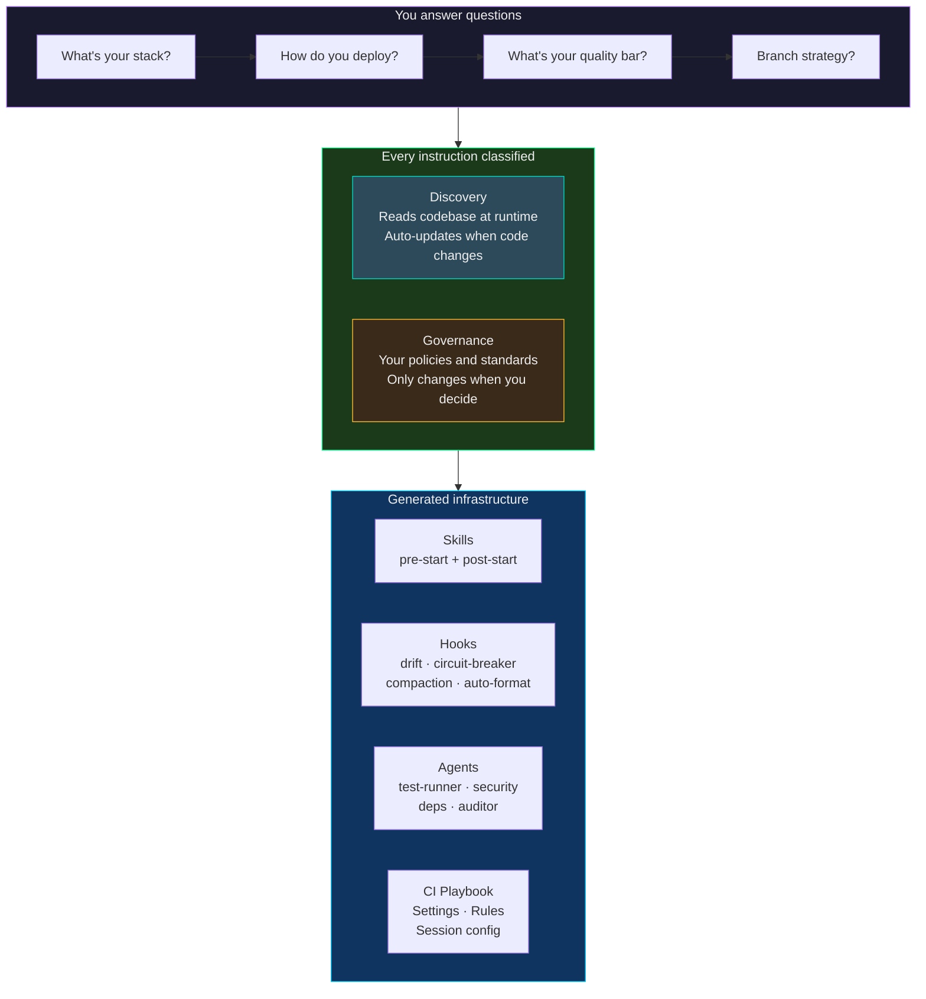
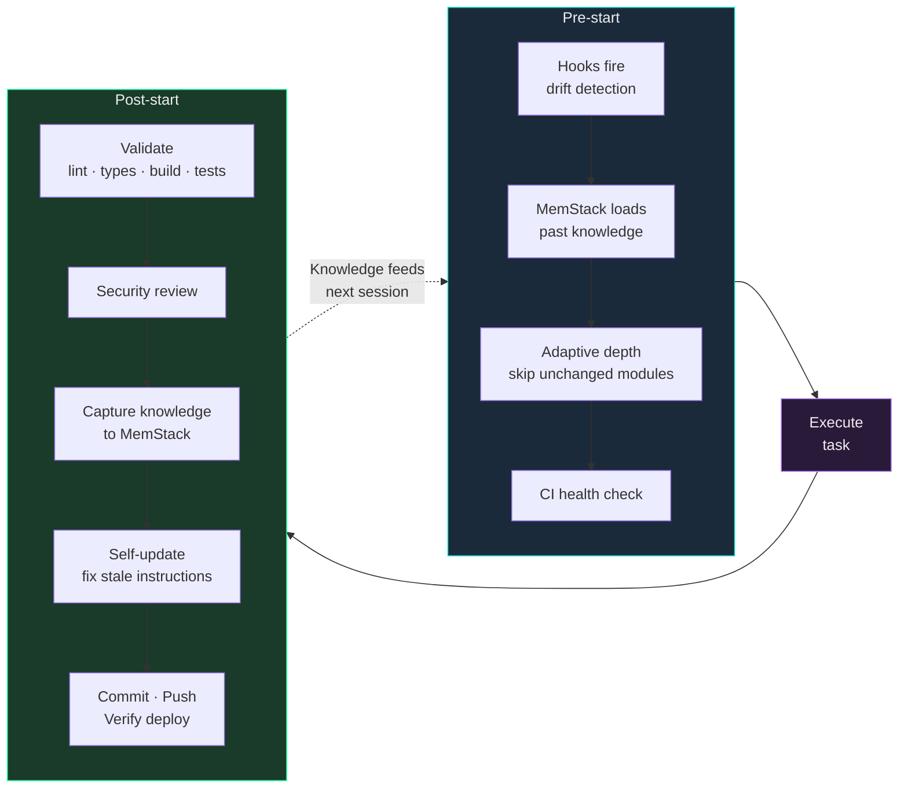
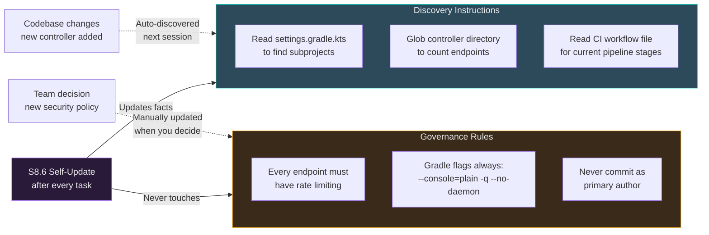
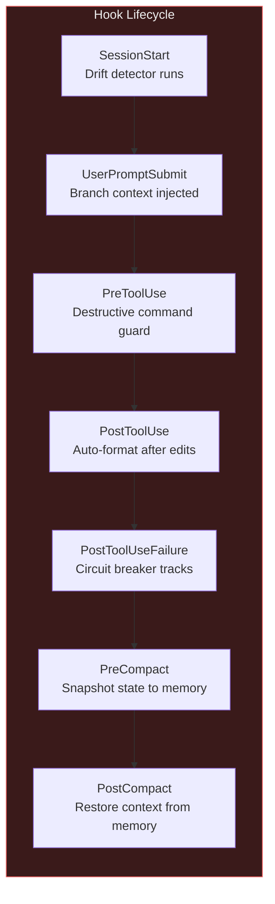

# scaffold-cli

**Templates rot. Collections require assembly. This generates self-maintaining Claude Code infrastructure from an interview.**

scaffold-cli is a meta-framework for Claude Code. It interviews you about your project — stack, deployment, quality bar, workflow preferences — then generates a complete `.claude/` infrastructure tailored to your specific setup. Every generated instruction is classified as **Discovery** (reads the codebase at runtime, never goes stale) or **Governance** (your policies, only change when you decide). The output self-corrects across sessions.

---

## Quick Start

```bash
# Install globally
npm install -g scaffold-cli

# Navigate to your project
cd my-project

# Run the interview → generates everything
scaffold init

# Verify infrastructure is complete
scaffold check
```

Or without installing:
```bash
npx scaffold-cli init
```

Or from inside Claude Code directly:
```bash
/scaffold-project
```

---

## How It Works



---

## The Session Loop

Once generated, your Claude Code sessions follow this self-improving loop:



**Each session reads less and knows more than the last.** Discovery instructions adapt to code changes. Knowledge insights are verified against source files. Stale instructions get corrected. The system compounds.

---

## The Core Idea: Discovery vs Governance

The architectural principle that makes generated infrastructure self-maintaining.



**Discovery** reads the filesystem at runtime:
```markdown
## 3. Architecture Map
Read the controller directory and count them:
Glob backend/src/main/java/com/example/controller/*
```
Add a controller → the agent discovers it naturally. No one updates the instruction.

**Governance** encodes your policies:
```markdown
## 5. Development Mentality
Every endpoint must have rate limiting.
Never commit as primary author — co-author only.
```
This only changes when you decide. The agent enforces it but never modifies it.

---

## CLI Commands

### `scaffold init`

Launches the interactive interview and generates all infrastructure files.

```
$ scaffold init

  Starting scaffold interview...

  Claude Code will ask about your project.
  Answer the questions — it generates your .claude/ infrastructure.
```

The interview covers 8 phases — identity, stack, architecture, deployment, quality, security, workflow, session management. Questions adapt based on your answers. "Spring Boot + Gradle" auto-infers Java, JUnit, and `./gradlew` without asking.

### `scaffold check`

Verifies all generated infrastructure files exist.

```
$ scaffold check

  Checking scaffold infrastructure in /home/user/my-project

  ✓ Pre-start skill (.claude/skills/pre-start-context/SKILL.md)
  ✓ Post-start skill (.claude/skills/post-start-validation/SKILL.md)
  ✓ Drift detector hook (.claude/hooks/drift-detector.sh)
  ✓ Circuit breaker hook (.claude/hooks/circuit-breaker.sh)
  ✓ Test runner agent (.claude/agents/test-runner.md)
  ✓ Security reviewer agent (.claude/agents/security-reviewer.md)
  ✓ CI playbook (.claude/ci-playbook.md)
  ✓ Session name (.claude/.session-name)
  ✓ Settings with hooks (.claude/settings.local.json)

  9/9 files present.
  Infrastructure complete.
```

### `scaffold install`

Installs the scaffold agent globally so you can use `/scaffold-project` from any Claude Code session.

```
$ scaffold install

  Installed scaffold-project agent to ~/.claude/agents/scaffold-project.md
  You can now run /scaffold-project from any Claude Code session.
```

---

## What Gets Generated

```
.claude/
├── skills/
│   ├── pre-start-context/SKILL.md        # Context loading workflow
│   └── post-start-validation/SKILL.md    # Validation + knowledge capture
├── hooks/
│   ├── drift-detector.sh                 # Checks if skill assumptions hold
│   ├── circuit-breaker.sh                # Detects failure loops
│   ├── pre-compact-snapshot.sh           # Saves state before compaction
│   └── post-compact-recovery.sh          # Restores context after compaction
├── agents/
│   ├── test-runner.md                    # Parallel test execution (Sonnet)
│   ├── security-reviewer.md             # Security audit (Opus, read-only)
│   ├── dependency-scanner.md            # Vulnerability scanning
│   └── skill-auditor.md                 # Workflow accuracy audit
├── rules/                               # Cross-session memory (if enabled)
│   ├── knowledge.md
│   ├── diary.md
│   └── echo.md
├── ci-playbook.md                        # Known CI failure patterns
├── .session-name                         # Notification routing
└── settings.local.json                   # Hooks + permissions

.agents/
└── workflows/
    ├── pre-start-context.md
    └── post-start-validation.md
```

Every file is tailored to your answers. Spring Boot → Gradle gates. Next.js → Biome + TSC gates. Kubernetes → pod health verification. Docker Compose → blue-green checks. Nothing generic.

---

## The Interview

| Phase | Questions | What it generates |
|-------|-----------|------------------|
| **Identity** | Name, description, purpose | Project IDs, session routing, skill headers |
| **Tech Stack** | Languages, frameworks, databases, build tools | Gate commands, test commands, dependency scanning |
| **Architecture** | Monolith/microservices, mono/multi-repo | Service discovery, cross-stack checks |
| **Deployment** | CI/CD, infrastructure, deploy strategy | Commit/push/verify flow, CI monitoring |
| **Quality** | Testing, linting, formatting, type checking | Validation gates, auto-format hooks |
| **Security** | Auth, rate limiting, uploads, headers | Security review checklist |
| **Workflow** | Branch strategy, commits, autonomy level | Execution policy, commit flow |
| **Session** | Remote access, notifications, persistence | Hooks, notifications, resume aliases |

---

## Why Not Templates?

| | Templates | Collections | scaffold-cli |
|---|---|---|---|
| Adapts to your stack | No | Manual | **Yes** |
| Self-maintaining | No | No | **Yes** |
| Integrated components | Partially | No | **Fully** |
| Classified instructions | No | No | **Yes** |
| Self-correcting | No | No | **Yes** |
| Time to setup | Hours | Days | **One session** |

---

## Hooks Generated

All hooks are **deterministic** (100% reliable) and **zero token cost** (run as shell commands, not LLM calls).



---

## Architecture Principles

1. **Enforce, don't instruct.** Hooks are 100% reliable at zero cost. CLAUDE.md is ~80%. If it matters, make it a hook.

2. **Discover, don't hardcode.** Every codebase fact is read at runtime. Files get added, versions change, pipelines evolve. Discovery adapts.

3. **Govern, don't hope.** Policies are enforced but never auto-modified. They change only when you change them.

4. **Compound, don't repeat.** Cross-session memory means each session builds on the last. Knowledge self-corrects over time.

5. **Survive, don't restart.** Compaction hooks save and restore state. Sessions reconnect. Context is never truly lost.

---

## Roadmap

- [x] Interview-driven scaffold agent
- [x] CLI (`scaffold init`, `scaffold check`, `scaffold install`)
- [ ] Template fragments per stack (Spring Boot, Next.js, Django, Go, Rust, Rails)
- [ ] `scaffold analyze` — reads existing project, generates infrastructure without interview
- [ ] `scaffold diff` — compares generated vs current, suggests updates
- [ ] `scaffold upgrade` — updates generated files when scaffold-cli adds new features
- [ ] Published npm package (`npx scaffold-cli init`)
- [ ] Test suite across sample projects
- [ ] Multi-agent orchestration templates

---

## License

MIT

---

*Built by [WhitehatD](https://github.com/WhitehatD).*
