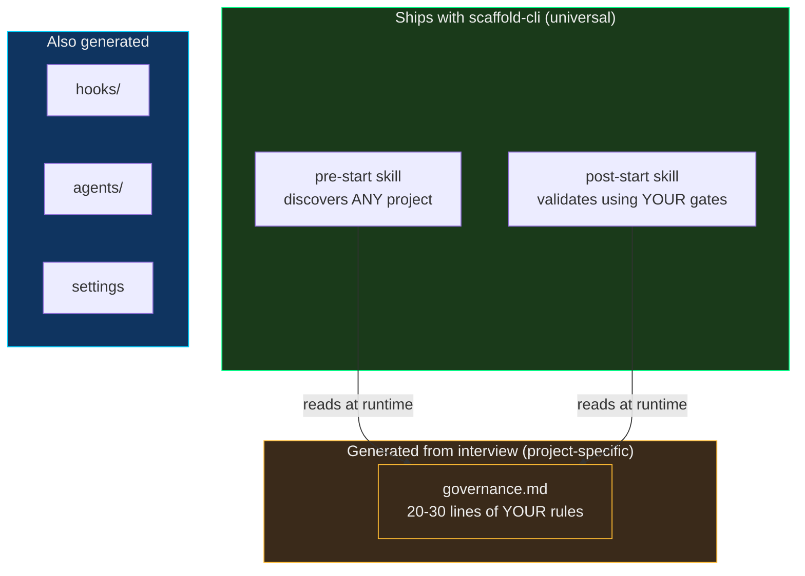
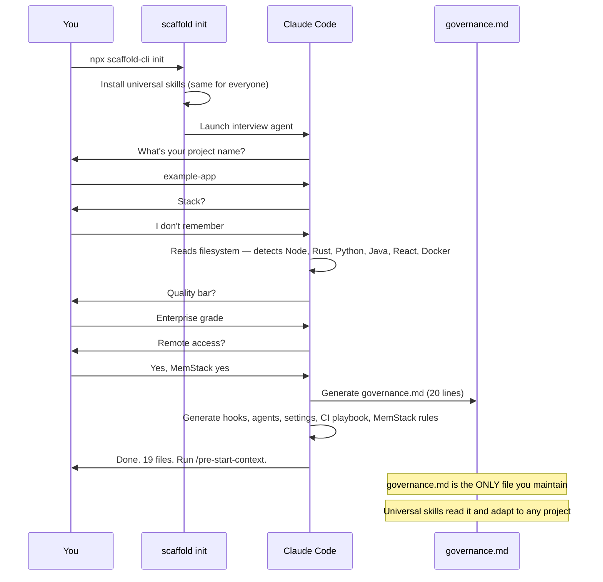
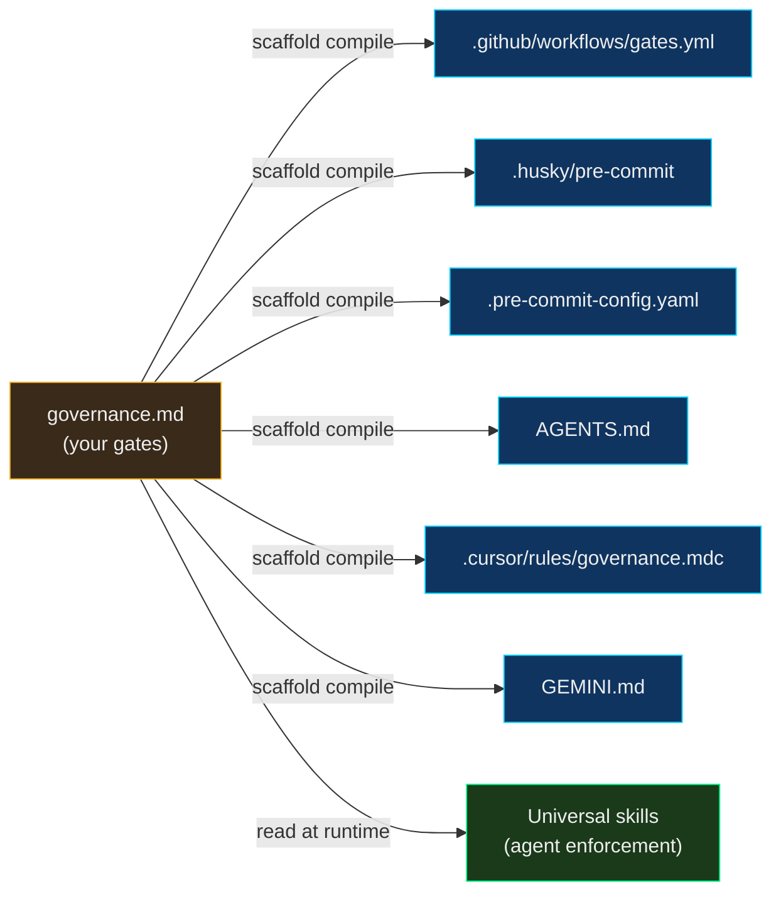
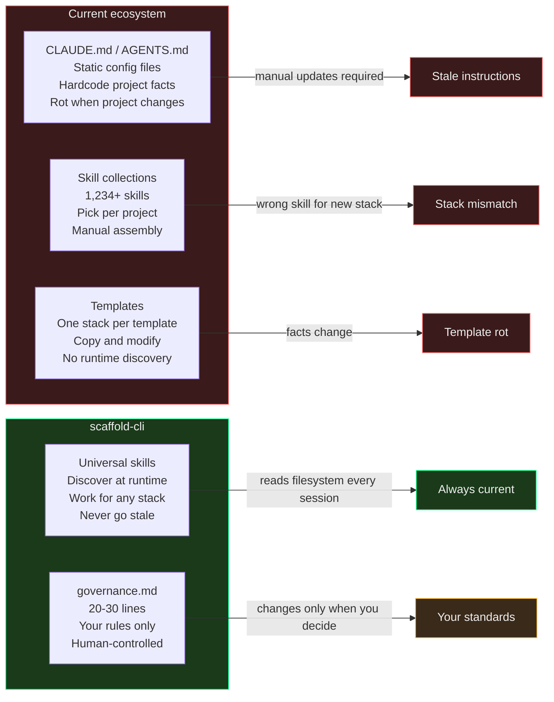
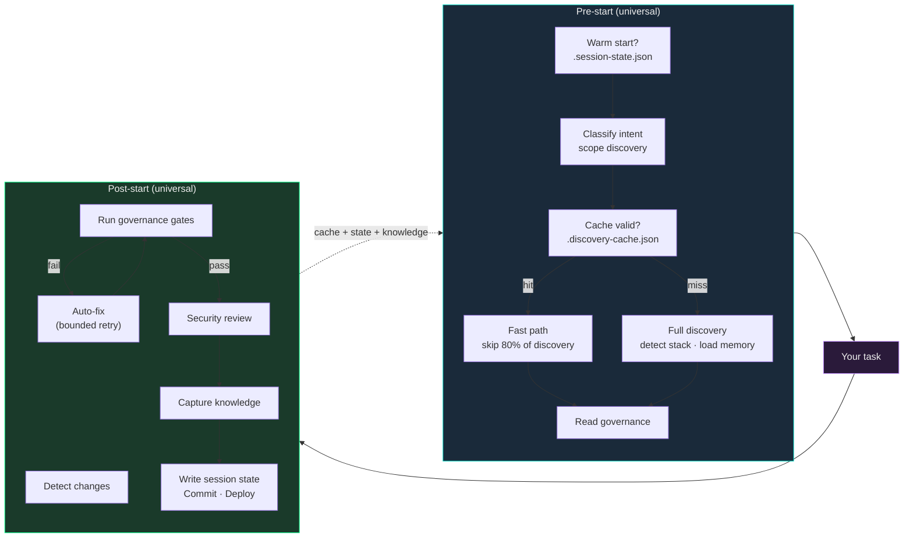

# scaffold-cli

**The infrastructure layer for AI coding agents. One config file. Works on any project. Self-maintaining forever.**

Every AI coding setup today is static — CLAUDE.md files, AGENTS.md configs, per-project templates, skill collections. They hardcode facts about your project. Facts change. Instructions rot. You maintain them or they lie to your agent.

scaffold-cli inverts this. It ships **universal skills** that discover any project at runtime — any language, any framework, any deployment target — and reads your rules from a single `governance.md` file. The skills are the engine. The governance is the config. The engine never goes stale because it reads the filesystem. The config is 20-30 lines you maintain.

```bash
npx scaffold-cli init
```

---

## Proven in Production

Not on demos. On real systems, in production, shipping to real infrastructure.

| Project | Stack | Services | Deployment | Result |
|---|---|---|---|---|
| **example-app** | Full-stack | Monolith | Docker | Full-stack governance generated |
| **example-app** | Multi-service | Services | Kubernetes | Multi-level governance hierarchy |
| **example-app** | Multi-language | Services | Docker Compose | Multiple languages detected, gates generated |
| **scaffold-cli** | Node.js CLI | Single module | npm (future) | Scaffolds itself — full dogfooding |

The same universal skills — written once, never modified per project — discovered multiple projects across varied stacks. Zero project-specific instructions in the skills. They discovered everything.

---

## The Architecture



The skills ship once and work forever. They don't know your stack — they discover it. They don't know your gates — they read them from governance.md. Add a service, change your CI, switch frameworks — the skills adapt. Nothing to update.

### The Core Insight: Discovery vs Governance

Every other tool in this space mixes "how to find things" with "what to enforce." scaffold-cli separates them cleanly:

- **Discovery** (universal skills) — reads the filesystem, detects runtimes, maps architecture, finds configs. Works on any project without modification.
- **Governance** (your governance.md) — defines YOUR rules: quality gates, security requirements, branch strategy, deployment pipeline. Changes only when YOU change it.

The skills handle discovery. governance.md handles governance. The skills never go stale because they re-discover every session. The governance never goes stale because it's your standards, not your file paths.

---

## How It Works



The agent adapts to your answers. When you say "I don't remember" — it reads the filesystem and figures it out. When you say "enterprise grade" — it picks the strictest gates available for your stack.

---

## Quick Start

```bash
npx scaffold-cli init       # Interview → generate governance + hooks + agents
npx scaffold-cli analyze    # Generate governance from existing project (no interview)
npx scaffold-cli check      # Verify infrastructure
npx scaffold-cli install    # Install agent globally for /scaffold-project
npx scaffold-cli compile    # Compile governance → CI, hooks, AGENTS.md, Cursor, Gemini
npx scaffold-cli diff       # Compare governance against codebase reality
npx scaffold-cli upgrade    # Update universal skills to latest version
npx scaffold-cli workspace  # Inspect detected workspace (type, members, governance)
```

After scaffolding, in any Claude Code session:
```bash
/pre-start-context           # Discovers project, loads governance, ready to work
# ... do your task ...
/post-start-validation       # Validates, captures knowledge, commits, deploys
```

---

## User Guide

### Installation

scaffold-cli is a zero-dependency Node.js CLI. You don't need to install it — run it via `npx`:

```bash
npx scaffold-cli <command>
```

Or install globally (once published to npm):
```bash
npm install -g scaffold-cli
scaffold <command>
```

**Requirements:**
- Node.js 18+ (uses built-in `https`, `crypto`, `fs`, `child_process`)
- Git (for branch strategy inference and discovery cache)
- Claude Code CLI (`claude --version`) — only needed for `scaffold init`

### Choosing Your Entry Point

scaffold-cli has two ways to generate governance for a project:

| Situation | Command | What happens |
|-----------|---------|--------------|
| New project, unsure of standards | `scaffold init` | Interactive interview — agent asks about your stack, quality bar, security, deployment |
| Existing project with CI/linters already configured | `scaffold analyze` | Zero-interview mode — reads your CI workflows, package.json scripts, linter configs, git history |
| Want to see what would be generated | `scaffold analyze --dry-run` | Prints inferred governance without writing |
| Already have governance, want to add inferred gates | `scaffold analyze --merge` | Preserves existing governance, appends inferred additions |
| Monorepo with sub-projects | `scaffold analyze --workspace` | Analyzes root + every workspace member |

### Command Reference

#### `scaffold init` — Interactive Setup

Runs an interview agent that asks about your project, then generates all infrastructure:

```bash
cd your-project
npx scaffold-cli init
```

**What gets generated:**
- `.claude/skills/pre-start-context/SKILL.md` — universal discovery skill
- `.claude/skills/post-start-validation/SKILL.md` — universal validation skill
- `.claude/governance.md` — your rules (from interview answers)
- `.claude/hooks/` — sandbox-guard, drift-detector, circuit-breaker, auto-post-start
- `.claude/agents/` — test-runner, security-reviewer, skill-auditor
- `.claude/settings.local.json` — permissions + hook wiring
- `.claude/ci-playbook.md` — empty template for known CI failures

After init, the skills are ready to use in any Claude Code session via `/pre-start-context`.

#### `scaffold analyze` — Zero-Interview Governance

Generates governance.md from your existing project without asking questions:

```bash
scaffold analyze              # Generate .claude/governance.md
scaffold analyze --dry-run    # Preview without writing
scaffold analyze --workspace  # Analyze all workspace members
scaffold analyze --merge      # Merge with existing governance
```

**What it detects:**
- **Stack:** Node, Rust, Python, Java, Go, Docker (from manifests)
- **Gates from CI:** parses `.github/workflows/*.yml` for `run:` steps
- **Gates from scripts:** `package.json` `test`, `lint`, `build`, `format`, `typecheck`
- **Linters:** ESLint, Biome, Prettier, Ruff, Clippy, Rustfmt, Mypy, TypeScript
- **Branch strategy:** feature branches vs trunk-based (from git history)
- **Commit convention:** conventional vs free-form (from git log)
- **Deployment:** Docker, Kubernetes, Vercel, Fly.io, Netlify, Render, Terraform

Output sections marked `# Inferred` should be reviewed.

#### `scaffold check` — Verify Infrastructure

Lists all core and optional files, shows which are present:

```bash
scaffold check
```

```
  Core:
    ✓ Pre-start skill (universal)
    ✓ Post-start skill (universal)
    ✓ Governance rules
    ✓ Drift detector hook
    ...

  9/9 core files present.
  Infrastructure complete.
```

Run this after `scaffold init` to verify everything was generated, or any time you're unsure if the setup is complete.

#### `scaffold compile` — Export Governance

Compiles your governance.md to multiple formats:

```bash
scaffold compile --target github        # .github/workflows/gates.yml
scaffold compile --target husky         # .husky/pre-commit
scaffold compile --target pre-commit    # .pre-commit-config.yaml
scaffold compile --target agents-md     # AGENTS.md (Codex, Cursor, Aider, Factory)
scaffold compile --target cursor        # .cursor/rules/governance.mdc
scaffold compile --target gemini        # GEMINI.md
scaffold compile --target all           # All 6 targets
scaffold compile                        # List available targets
```

**Why this matters:** one governance.md becomes your CI workflow, your git hooks, and configuration for every AI coding tool. Change a gate once, recompile, done.

#### `scaffold diff` — Governance Drift Detection

Compares governance.md against codebase reality:

```bash
scaffold diff
```

```
  MATCH   node --check bin/scaffold.js
  DRIFT   ESLint referenced but biome.json found
  MISSING CI gate: cargo test              (in governance, not in CI)
  EXTRA   docker build                     (in CI, not in governance)

  3 match, 1 drift, 1 missing, 1 extra
```

Use this to catch governance drift before CI fails. Run before every PR, or in CI to enforce governance matches reality.

#### `scaffold upgrade` — Update Skills

Updates universal skills in the current project to the latest version:

```bash
scaffold upgrade                # Update skills in current project
scaffold upgrade --check        # Dry run — show what would change
scaffold upgrade --workspace    # Update all workspace members
scaffold upgrade --force        # Overwrite locally modified skills (creates backup)
```

**How it works:**
- Skills track their version in YAML frontmatter (`version: 0.2.0`)
- A `source_hash` (SHA-256) detects local modifications
- If you modified a skill locally, upgrade won't overwrite it without `--force`
- When force-overwriting, a timestamped backup is created (`SKILL.md.bak.1712252400`)

#### `scaffold workspace` — Inspect Workspace

Shows the detected workspace, all members, their tech stacks, and governance hierarchy:

```bash
scaffold workspace              # Human-readable
scaffold workspace --json       # Machine-readable JSON (for CI/scripting)
```

Example output:
```
  Workspace: npm
  Root: /path/to/monorepo
  Config: package.json
  Members: 3
  Root governance: 2 gate section(s), runtimes: node

  Members:
    ✓ backend                        [node]
      packages/backend
    ✓ frontend                       [node]  (inherits)
      packages/frontend
    ○ shared                         [node]
      packages/shared
```

Use this to debug workspace detection or understand governance inheritance in monorepos.

#### `scaffold install` — Install Global Agent

Installs the scaffold-project agent to `~/.claude/agents/` so you can invoke it with `/scaffold-project` from any Claude Code session:

```bash
scaffold install
```

#### `scaffold version` / `scaffold help`

```bash
scaffold version              # Print version
scaffold help                 # Print usage
```

### The Session Loop

Once scaffold-cli is set up, your workflow in any Claude Code session becomes:

```
1. /pre-start-context       → Discovers project, loads governance, checks skill currency
2. ... your task ...        → Write code, fix bugs, add features
3. /post-start-validation   → Runs gates, security review, captures knowledge, commits
```

**Pre-start does:**
- Detects workspace type (pnpm, Cargo, Go, Gradle, Maven, Nx, Turbo, Bazel, submodules, nested repos)
- Enumerates members and checks for multi-level governance
- Detects runtime versions (Node, Java, Python, Go, Rust, Docker)
- Reads governance.md and applies rules for the session
- Loads cross-session memory (if MemStack enabled)
- Checks skill currency — notifies if `scaffold upgrade` available

**Post-start does:**
- Runs governance gates in order (stops on failure)
- Auto-fixes mechanical errors (lint, format) with bounded retry
- Runs security review (grep for secrets, check new endpoints)
- Captures knowledge (insights, sessions) if MemStack enabled
- Commits with conventional commit format
- Writes `.session-state.json` for next session's warm start

### Common Workflows

**Workflow 1: Add scaffold-cli to an existing project**
```bash
cd my-existing-project
npx scaffold-cli analyze --dry-run    # Preview what it would generate
npx scaffold-cli analyze              # Write .claude/governance.md
# Review the generated file, adjust as needed
npx scaffold-cli check                # Verify infrastructure
# Use /pre-start-context in Claude Code
```

**Workflow 2: Start a brand new project**
```bash
mkdir my-new-project && cd my-new-project
git init
npx scaffold-cli init                 # Interactive interview
# Follow the prompts — agent asks ~20 questions
# Skills + hooks + agents are all generated
npx scaffold-cli check
```

**Workflow 3: Monorepo with per-service governance**
```bash
cd my-monorepo
npx scaffold-cli init                  # Root-level governance
cd packages/backend
npx scaffold-cli analyze --merge       # Add backend-specific gates
cd ../../packages/frontend
npx scaffold-cli analyze --merge       # Add frontend-specific gates
# Now each package has its own governance.md, and root has cross-cutting rules
```

**Workflow 4: Keep everything current**
```bash
npx scaffold-cli upgrade --check       # See what would update
npx scaffold-cli upgrade               # Apply updates (preserves local changes)
npx scaffold-cli diff                  # Check governance hasn't drifted
npx scaffold-cli compile --target all  # Regenerate CI workflows, hooks, cross-agent files
```

**Workflow 5: Switch AI tools (Claude → Cursor → Gemini)**
```bash
npx scaffold-cli compile --target agents-md    # Generate AGENTS.md
npx scaffold-cli compile --target cursor       # Generate .cursor/rules/
npx scaffold-cli compile --target gemini       # Generate GEMINI.md
# Same governance rules now work in Codex, Cursor, Gemini CLI, Aider, Factory
```

### Troubleshooting

**Q: `scaffold init` says "Claude Code CLI not found"**
A: Install Claude Code from https://claude.com/claude-code. Only `init` needs it; other commands don't.

**Q: `scaffold upgrade` shows "locally modified" and won't update**
A: You edited a skill file. Either (1) accept that your edits are preserved and stay on the old version, or (2) run `scaffold upgrade --force` to overwrite (backup is created).

**Q: `scaffold analyze` generates nothing useful**
A: It needs signals — CI configs, package.json scripts, linter configs. For greenfield projects, use `scaffold init` for the interview flow instead.

**Q: `scaffold diff` reports drift but my CI is working**
A: Drift means governance.md says one thing and the codebase uses another. Either update governance.md to match reality, or update the codebase to match governance. Both are valid.

**Q: Update checker shows "v1.0.0 available" but I have the dev version**
A: Another package named `scaffold-cli` exists on npm. Once this is published under a scoped name, the checker will target the correct package. For now, the notice is cosmetic.

**Q: Skills don't auto-update when I run `/pre-start-context`**
A: Auto-update runs via the CLI commands, not the skill itself. Run `scaffold upgrade` from your terminal. The skill reports skill version on pre-start so you know when to run upgrade.

**Q: Multi-level governance not merging correctly**
A: Check that member governance files use `## Gates (inherit: root)` to opt in to inheritance. Without this marker, member governance replaces root.

---

## governance.md

The only file you maintain. 20-30 lines. Everything else is universal.

```markdown
# Governance — example-app

## Identity
- Project: example-app
- Description: Example project using crag

## Gates (run in order, stop on failure)
### Frontend
- npx eslint frontend/ --max-warnings 0
- cd frontend && npx vite build

### Backend
- node --check scripts/server.js scripts/worker.js scripts/queue.js
- cargo clippy --manifest-path api/Cargo.toml
- cargo test --manifest-path api/Cargo.toml

### Infrastructure
- docker compose config --quiet

## Branch Strategy
- Trunk-based, conventional commits
- Auto-commit after all gates pass

## Security
- No hardcoded secrets
- No hardcoded secrets or API keys in source
```

Change a gate → takes effect next session. Add a security rule → enforced immediately. The skills read this file every time — they never cache stale instructions.

### Governance v2 annotations (optional)

Gate sections support optional annotations for workspace-aware execution:

```markdown
## Gates (run in order, stop on failure)
### Frontend (path: frontend/)          # cd to frontend/ before running
- npx biome check .                     # [MANDATORY] (default)
- npx tsc --noEmit                      # [OPTIONAL] — warn but don't fail

### TypeScript (if: tsconfig.json)       # skip section if file doesn't exist
- npx tsc --noEmit

## Gates (inherit: root)                 # merge with root governance
```

All annotations are optional. Existing governance files work unchanged.

### Multi-level governance (monorepos)

For projects with multiple sub-repos or services, governance can be hierarchical:

```
project-root/
├── .claude/governance.md          # Cross-stack: branch strategy, deployment, security
├── backend/.claude/governance.md  # Backend-specific: Gradle gates, service tests
└── frontend/.claude/governance.md # Frontend-specific: Biome, Vitest, responsive audit
```

Each level gets the same universal skills. Each reads its own governance.md. Open Claude Code at the root — get the cross-stack view. Open it in backend/ — get backend-specific gates. The skills adapt to wherever you are.

---

## Governance Compiler

governance.md is agent-readable. But the gates in it are just shell commands — they can also drive your CI pipeline and git hooks. One source of truth, multiple outputs:

```bash
scaffold compile --target github      # .github/workflows/gates.yml
scaffold compile --target husky       # .husky/pre-commit
scaffold compile --target pre-commit  # .pre-commit-config.yaml
scaffold compile --target agents-md   # AGENTS.md (Codex, Cursor, Aider, Factory)
scaffold compile --target cursor      # .cursor/rules/governance.mdc
scaffold compile --target gemini      # GEMINI.md
scaffold compile --target all         # All of the above
```

The compiler parses your gates, auto-detects runtimes from the commands (Node, Rust, Python, Java, Go, Docker), and generates the right setup steps. Human-readable "Verify X contains Y" gates are compiled to `grep` commands automatically. Cross-agent targets (AGENTS.md, Cursor, Gemini) let you use the same governance across any AI coding tool.



Governance-as-config that compiles to agent behavior, CI/CD pipelines, and cross-agent configs from a single 20-line file.

---

## Zero-Interview Mode

Don't want an interview? `scaffold analyze` generates governance from your existing project:

```bash
scaffold analyze              # Infer governance from codebase + CI
scaffold analyze --dry-run    # Preview without writing
scaffold analyze --workspace  # Analyze all workspace members
scaffold analyze --merge      # Merge with existing governance
```

It reads your CI workflows, package.json scripts, linter configs, git history, and deployment configs. Outputs governance.md with `# Inferred` markers so you know what to verify.

---

## Governance Drift Detection

`scaffold diff` compares your governance.md against codebase reality:

```bash
scaffold diff
```

```
  MATCH   node --check bin/scaffold.js     (tool exists)
  DRIFT   ESLint referenced but biome.json found
  MISSING CI gate: cargo test              (in governance, not in CI)
  EXTRA   CI step: docker build            (in CI, not in governance)

  3 match, 1 drift, 1 missing, 1 extra
```

---

## Workspace Detection

scaffold-cli auto-detects 11+ workspace types:

| Marker | Workspace Type |
|--------|----------------|
| `pnpm-workspace.yaml` | pnpm |
| `package.json` with `"workspaces"` | npm/yarn |
| `Cargo.toml` with `[workspace]` | Cargo |
| `go.work` | Go |
| `settings.gradle.kts` with `include(` | Gradle |
| `pom.xml` with `<modules>` | Maven |
| `nx.json` | Nx |
| `turbo.json` | Turborepo |
| `WORKSPACE` / `MODULE.bazel` | Bazel |
| `.gitmodules` | Git submodules |
| Multiple child `.git` dirs | Independent repos |

Workspace members are enumerated, checked for their own `.claude/governance.md`, and their tech stacks detected. Multi-level governance merges root gates (mandatory) with member gates (additive).

---

## Auto-Update

Skills track their version in YAML frontmatter. When you run any scaffold command, it checks for updates:

```bash
scaffold upgrade              # Update skills in current project
scaffold upgrade --workspace  # Update all workspace members
scaffold upgrade --check      # Dry run — show what would change
scaffold upgrade --force      # Overwrite locally modified skills (with backup)
```

The update checker queries the npm registry (cached for 24 hours, 3s timeout, graceful failure offline). Skills are only overwritten if the user hasn't modified them — local modifications are detected via content hash and preserved unless `--force` is used.

---

## What Ships vs What's Generated

| Component | Source | Maintains itself? |
|-----------|--------|-------------------|
| Pre-start skill | **Ships universal** | Yes — discovers at runtime, caches results, auto-updates |
| Post-start skill | **Ships universal** | Yes — reads governance for gates, auto-fixes, auto-updates |
| `governance.md` | **Generated from interview or analyze** | No — you maintain it (20-30 lines) |
| Hooks | **Generated for your tools** | Yes — sandbox guard + drift detector + gate enforcement |
| Agents | **Generated for your stack** | Yes — read governance for commands |
| Settings | **Generated** | Yes — RTK wildcards cover new tools |
| CI playbook | **Generated template** | You add entries as failures are found |
| Compile targets | **Generated on demand** | `scaffold compile` regenerates from governance (6 targets) |
| Workspace detection | **Ships universal** | Yes — detects 11+ workspace types at runtime |
| Governance diff | **Ships universal** | Yes — compares governance vs codebase reality |

---

## Why Everything Else Is Static



---

## The Session Loop



### What makes this loop tight

| Feature | What it does | Savings |
|---|---|---|
| **Discovery cache** | Hashes build files, skips unchanged domains | ~80% of pre-start tool calls on unchanged projects |
| **Intent-scoped discovery** | Classifies task, skips irrelevant domains | Skip frontend discovery for backend bugs, and vice versa |
| **Session continuity** | Reads `.session-state.json` for warm starts | Near-zero-latency startup when continuing work |
| **Gate auto-fix** | Fixes lint/format errors, retries gate (max 2x) | Eliminates human round-trip for mechanical failures |
| **Auto-post-start** | Hook warns before commit if gates haven't run | Removes "forgot to validate" failure mode |
| **Sandbox guard** | Hard-blocks destructive commands at hook level | Security at system level, not instruction level |
| **Workspace detection** | Detects 11+ workspace types, enumerates members | Automatic monorepo/polyrepo awareness |
| **Auto-update** | Version-tracked skills with hash-based conflict detection | Skills stay current across all projects |
| **Governance diff** | Compares governance.md against actual codebase | Catches drift before it causes failures |

No agent framework does all of these. Most re-discover cold every session, require manual validation, and trust instructions for safety.

---

## Generated Infrastructure

```
.claude/
├── governance.md                         # YOUR rules (only custom file)
├── skills/
│   ├── pre-start-context/SKILL.md        # Universal discoverer
│   └── post-start-validation/SKILL.md    # Universal validator
├── hooks/
│   ├── sandbox-guard.sh                  # Hard-blocks destructive commands
│   ├── auto-post-start.sh               # Gate enforcement before commits
│   ├── drift-detector.sh                 # Checks key files exist
│   ├── circuit-breaker.sh                # Failure loop detection
│   ├── pre-compact-snapshot.sh           # Memory before compaction
│   └── post-compact-recovery.sh          # Memory after compaction
├── agents/
│   ├── test-runner.md                    # Parallel tests (Sonnet)
│   ├── security-reviewer.md             # Security audit (Opus)
│   ├── dependency-scanner.md            # Vulnerability scan
│   └── skill-auditor.md                 # Infrastructure audit
├── rules/                               # Cross-session memory
├── ci-playbook.md                       # Known CI failures
├── .session-name                        # Notification routing
├── .discovery-cache.json                 # Cached discovery (auto-generated)
├── .session-state.json                   # Session continuity (auto-generated)
├── .gates-passed                         # Gate sentinel (auto-generated)
└── settings.local.json                  # Hooks + permissions
```

---

## Principles

1. **Discover, don't hardcode.** Every fact about the codebase is read at runtime. The skills never say "22 controllers" — they say "read the controller directory."

2. **Govern, don't hope.** Your quality bar lives in governance.md. The skills enforce it but never modify it. It changes only when you change it.

3. **Ship the engine, generate the config.** Universal skills ship once. governance.md is generated per-project. The engine works forever. The config is 20 lines.

4. **Enforce, don't instruct.** Hooks are 100% reliable at zero token cost. CLAUDE.md rules are ~80% compliance. Critical behavior goes in hooks.

5. **Compound, don't restart.** Cross-session memory means each session knows what the last one learned. Knowledge self-verifies against source files.

6. **Guard, don't trust.** Security hooks hard-block destructive commands at the system level — `rm -rf /`, `DROP TABLE`, `curl|bash`, force-push to main. Even if instructions are misread, the sandbox catches it. Defense in depth: hooks enforce what skills instruct.

7. **Cache, don't re-discover.** Every discovery result is cached with content hashes. If nothing changed, the next session starts in seconds, not minutes. The cache is advisory — if it's wrong, full discovery runs as normal.

---

## Prior Art

An independent review assessed every major AI coding tool, open-source project, academic paper, and patent filing as of April 2026. The closest candidates and why they differ:

| Candidate | What it does | Why it's not this |
|---|---|---|
| **AGENTS.md** (60K+ repos) | Static config file AI agents read | Human-maintained, multiple files by scope, no runtime discovery |
| **Claude Code** `/init` + CLAUDE.md | Scans repo, generates static instructions | Generates static output that rots. Multiple files. No governance separation |
| **Cursor** `.cursor/rules/` | Per-directory rule files | Static context, multiple artifacts, no universal engine |
| **Gemini CLI** GEMINI.md hierarchy | JIT instruction file scanning | Discovers *instruction files*, not the project itself |
| **Kiro** steering docs | Generates product/tech/structure docs | Multiple steering files, not single governance, not universal |
| **Codex** AGENTS.md + hooks + skills | Layered static instructions + extensibility | Instruction chain by directory. Could host this engine but doesn't ship one |
| **claude-code-kit** | Framework detection + generated .claude/ | Kit/framework-specific (Next.js, React, Express). Not universal polyglot |
| **OpenDev** (arxiv paper) | CLI agent with lazy tool discovery | Research prototype. No governance file. Not productized |
| **Repo2Run** (arxiv paper) | Repo → runnable Dockerfile synthesis | Build/CI domain only. No agent governance architecture |

**Adjacent patents identified:**
- **US20250291583A1** (Microsoft) — YAML-configured agent rules/actions. Covers "config file drives AI agents" broadly but not universal repo discovery.
- **US9898393B2** (Solano Labs) — Repo pattern analysis → inferred CI config. Strong historic prior art for build-system discovery, but not AI agent governance.

Neither patent blocks this architecture. Both are adjacent, not overlapping.

**Three novelty hypotheses validated by the review:**
1. **Compositional:** Many systems have pieces (hooks, skills, context files). None compose them into universal discovery engine + single governance file + continuously regenerated artifacts.
2. **Scope:** Closest implementations (claude-code-kit) are framework-specific, not polyglot-universal.
3. **Governance-as-contract:** Existing tools treat instruction files as context (often non-enforced). This treats governance as an executable contract that deterministically shapes gates and commit behavior.

---

## Roadmap

- [x] Universal pre-start and post-start skills
- [x] Interview-driven governance generation
- [x] CLI (`scaffold init`, `scaffold check`, `scaffold install`)
- [x] Proven on 5-language multi-service project (example-app)
- [x] Proven on full-stack monolith with deployment (example-app)
- [x] Proven on multi-service platform (example-app)
- [x] Multi-level governance hierarchy (root + backend + frontend)
- [x] `scaffold compile` — governance.md → GitHub Actions, husky, pre-commit, AGENTS.md, Cursor, Gemini
- [x] Incremental discovery cache — content-addressed, skips 80% of pre-start on unchanged projects
- [x] Intent-scoped discovery — classifies task, skips irrelevant domains
- [x] Session continuity — warm starts via `.session-state.json`
- [x] Gate auto-fix loop — fixes lint/format errors automatically, bounded retry (max 2x)
- [x] Auto-post-start hook — gate enforcement before commits
- [x] Sandbox guard — hard-blocks destructive commands (rm -rf /, DROP TABLE, curl|bash, force-push main)
- [x] `scaffold analyze` — generate governance from existing project without interview
- [x] `scaffold diff` — compare governance against codebase reality
- [x] `scaffold upgrade` — update universal skills when new version ships
- [x] Workspace detection — 11+ types (pnpm, npm, Cargo, Go, Gradle, Maven, Nx, Turbo, Bazel, submodules, nested repos)
- [x] Governance v2 format — path-scoped gates, conditional sections, mandatory/optional classification
- [x] Auto-update — version tracking, npm registry check, content-hash conflict detection
- [x] Cross-agent compilation — AGENTS.md, .cursor/rules, GEMINI.md from single governance file
- [x] Modular architecture — 20 modules across 6 directories (zero dependencies)
- [ ] Published npm package
- [ ] Cross-repo benchmark — 20-30 repos, measure coverage %, false positives, failure modes
- [ ] Drift resilience test — add services, change linters, rename directories. Does the engine re-discover?
- [ ] Baseline comparison — same governance in AGENTS.md, CLAUDE.md, .cursor/rules, GEMINI.md
- [ ] Cross-agent compatibility (Cursor, Codex, Gemini CLI, Aider)

---

## License

MIT

---

*Built by [WhitehatD](https://github.com/WhitehatD)*
