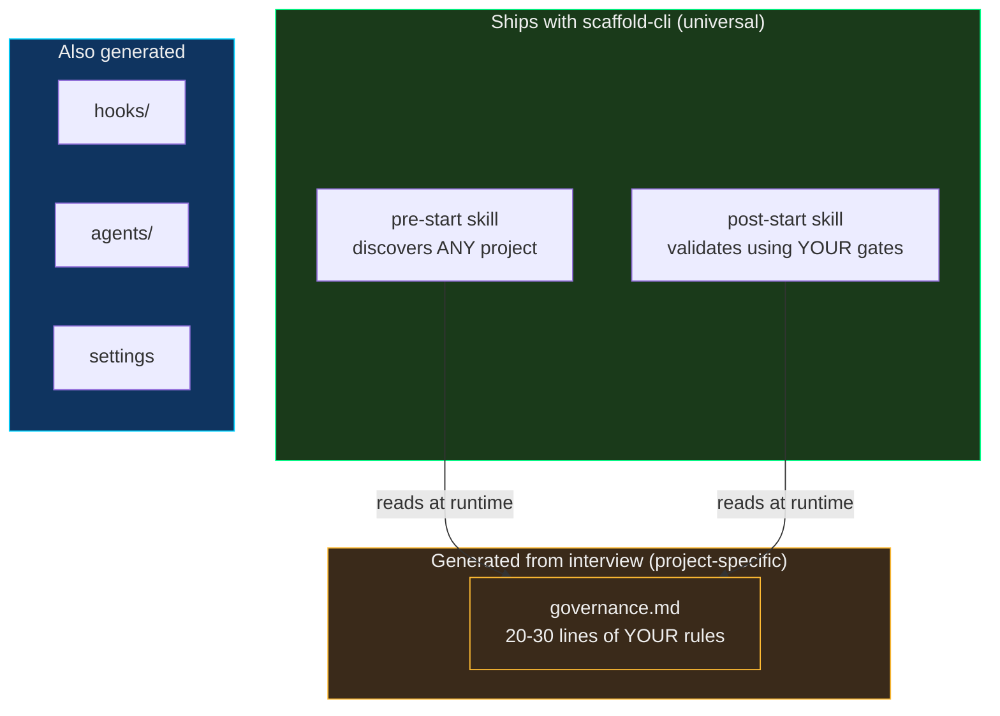
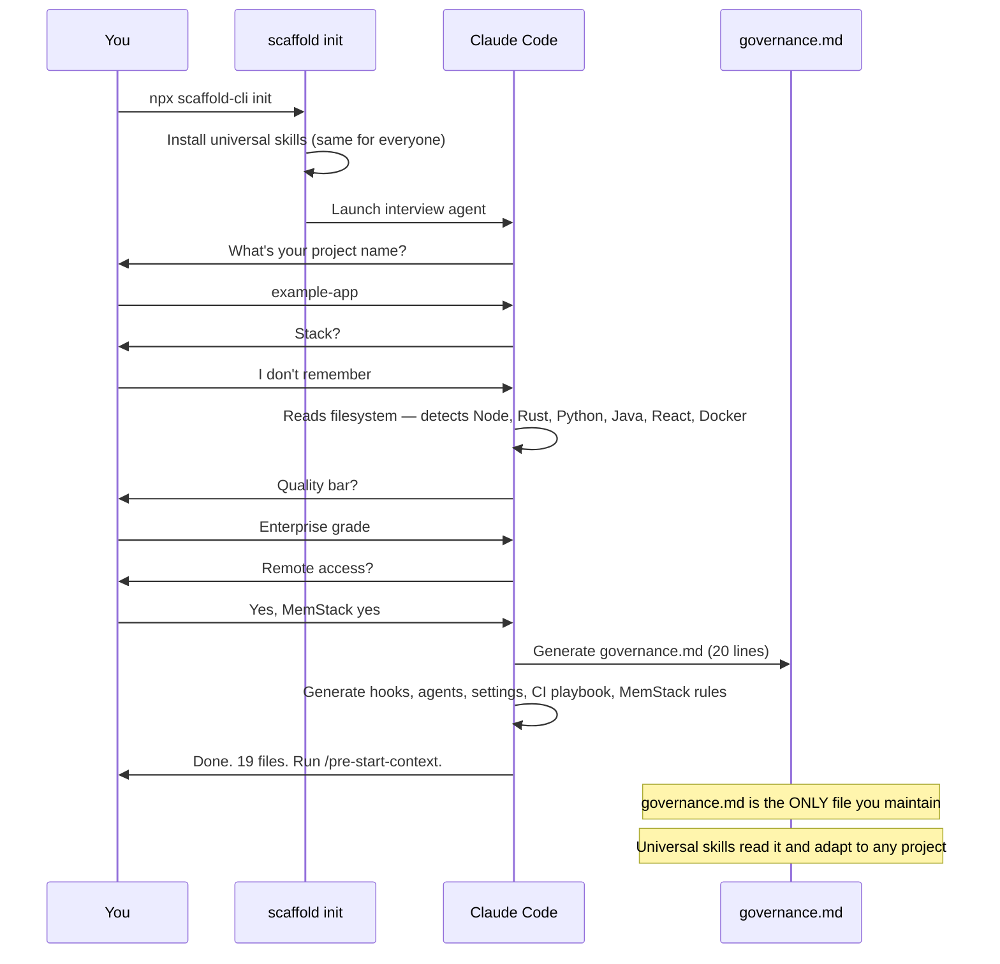
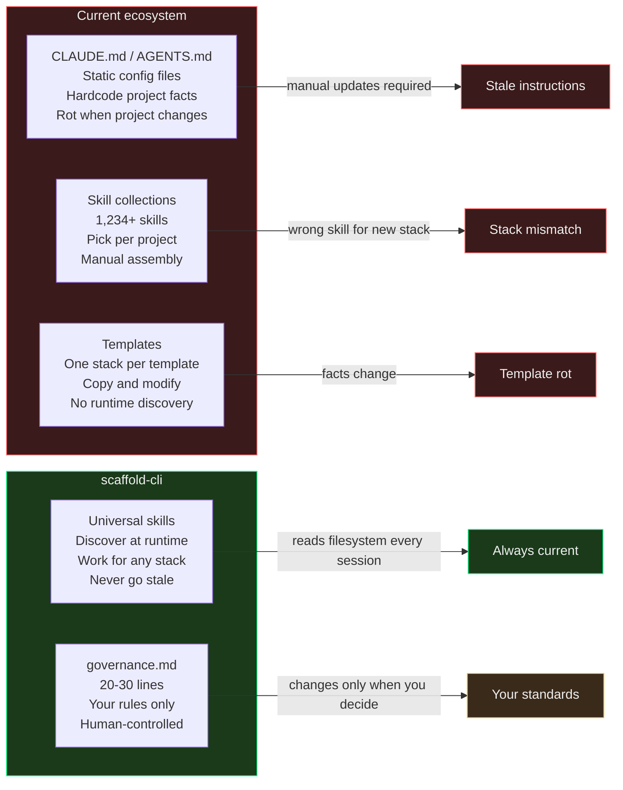
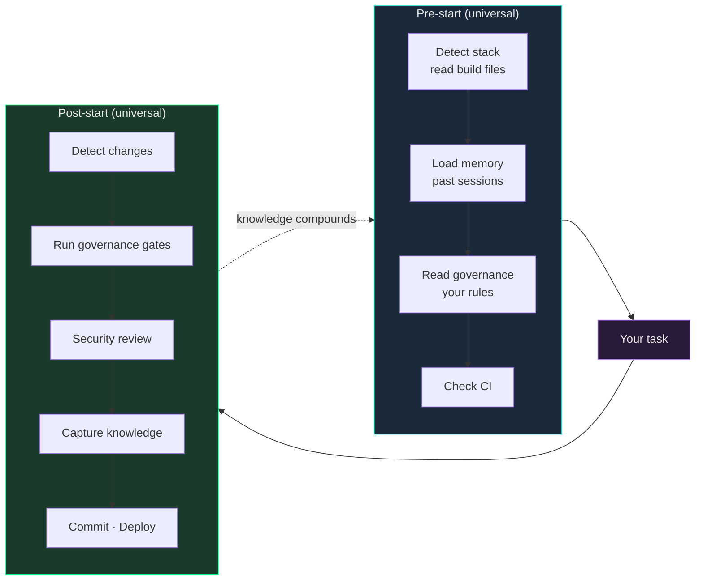

# scaffold-cli

**Universal runtime layer for AI coding agents. One config file. Self-maintaining forever.**

Every AI coding setup today is static — CLAUDE.md files, AGENTS.md configs, per-project templates, skill collections. They hardcode facts about your project. Facts change. Instructions rot. You maintain them or they lie to your agent.

scaffold-cli inverts this. It ships **universal skills** that discover any project at runtime — any language, any framework, any deployment target — and reads your rules from a single `governance.md` file. The skills are the engine. The governance is the config. The engine never goes stale because it reads the filesystem. The config is 20-30 lines you maintain.

**Nothing like this exists.** We searched every public repo, every skill library (1,234+), every AI coding tool (Claude Code, Cursor, Codex, Aider, Kiro, Zencoder), every standard (AGENTS.md, SKILL.md), every framework. Everything out there is project-specific — templates for React, skills for Spring Boot, configs per stack. Nobody built a universal skill that works for everything by separating the engine from the rules.

```bash
npx scaffold-cli init
```

---

## The Architecture



The skills ship once and work forever. They don't know your stack — they discover it. They don't know your gates — they read them from governance.md. Add a service, change your CI, switch frameworks — the skills adapt. Nothing to update.

---

## Proven: 5 Languages, 9 Services, Zero Configuration

Tested on example-app — a multi-language project.

The universal pre-start skill — written once, never modified for this project — produced:

```
Runtimes: Node v25.2.1 · Java 21.0.4 · Python 3.12.3 · Rust 1.90.0 · Git 2.47.0 · Docker 29.2.0

Architecture:
example-app (Docker Compose)
├── web/               React + Vite
├── scripts/           Node.js backend
│   ├── server.js          API
│   ├── worker.js          background worker
│   ├── render.mjs         render service
│   └── ai.mjs             AI service
├── api/                Rust module
├── Dockerfile.java    Java service
└── docker-compose.yml 9 services

Governance Applied:
- Gates: ESLint → Vite build → node --check → Clippy → cargo test → docker compose config
- Branch: Trunk-based, conventional commits, auto-commit after gates
- Formatters: Prettier (JS/TS), rustfmt (Rust), ruff (Python)

Flags:
- Many latest deps — should pin versions
- No tests anywhere — needs test infrastructure
- No CI workflows — playbook template ready
```

Zero project-specific instructions in the skill. It discovered everything.

---

## How It Works



The agent adapts to your answers. When you say "I don't remember" — it reads the filesystem and figures it out. When you say "enterprise grade" — it picks the strictest gates available for your stack.

---

## Quick Start

```bash
npx scaffold-cli init       # Interview → generate governance + hooks + agents
npx scaffold-cli check      # Verify infrastructure
npx scaffold-cli install    # Install agent globally for /scaffold-project
```

After scaffolding, in any Claude Code session:
```bash
/pre-start-context           # Discovers project, loads governance, ready to work
# ... do your task ...
/post-start-validation       # Validates, captures knowledge, commits, deploys
```

---

## governance.md

The only file you maintain. 20-30 lines. Everything else is universal.

```markdown
# Governance — example-app

## Identity
- Project: example-app
- Description: Example project using crag

## Gates (run in order, stop on failure)
### Frontend
- npx eslint frontend/ --max-warnings 0
- cd frontend && npx vite build

### Backend
- node --check scripts/server.js scripts/worker.js scripts/queue.js
- cargo clippy --manifest-path api/Cargo.toml
- cargo test --manifest-path api/Cargo.toml

### Infrastructure
- docker compose config --quiet

## Branch Strategy
- Trunk-based, conventional commits
- Auto-commit after all gates pass

## Security
- No hardcoded secrets
- No hardcoded secrets or API keys in source
```

Change a gate → takes effect next session. Add a security rule → enforced immediately. The skills read this file every time — they never cache stale instructions.

---

## What Ships vs What's Generated

| Component | Source | Maintains itself? |
|-----------|--------|-------------------|
| Pre-start skill | **Ships universal** | Yes — discovers at runtime |
| Post-start skill | **Ships universal** | Yes — reads governance for gates |
| `governance.md` | **Generated from interview** | No — you maintain it (20-30 lines) |
| Hooks | **Generated for your tools** | Yes — drift detector adapts |
| Agents | **Generated for your stack** | Yes — read governance for commands |
| Settings | **Generated** | Yes — RTK wildcards cover new tools |
| CI playbook | **Generated template** | You add entries as failures are found |

---

## Why Everything Else Is Static



---

## The Session Loop



---

## Generated Infrastructure

```
.claude/
├── governance.md                         # YOUR rules (only custom file)
├── skills/
│   ├── pre-start-context/SKILL.md        # Universal discoverer
│   └── post-start-validation/SKILL.md    # Universal validator
├── hooks/
│   ├── drift-detector.sh                 # Checks key files exist
│   ├── circuit-breaker.sh                # Failure loop detection
│   ├── pre-compact-snapshot.sh           # Memory before compaction
│   └── post-compact-recovery.sh          # Memory after compaction
├── agents/
│   ├── test-runner.md                    # Parallel tests (Sonnet)
│   ├── security-reviewer.md             # Security audit (Opus)
│   ├── dependency-scanner.md            # Vulnerability scan
│   └── skill-auditor.md                 # Infrastructure audit
├── rules/                               # Cross-session memory
├── ci-playbook.md                       # Known CI failures
├── .session-name                        # Notification routing
└── settings.local.json                  # Hooks + permissions
```

---

## Principles

1. **Discover, don't hardcode.** Every fact about the codebase is read at runtime. The skills never say "22 controllers" — they say "read the controller directory."

2. **Govern, don't hope.** Your quality bar lives in governance.md. The skills enforce it but never modify it. It changes only when you change it.

3. **Ship the engine, generate the config.** Universal skills ship once. governance.md is generated per-project. The engine works forever. The config is 20 lines.

4. **Enforce, don't instruct.** Hooks are 100% reliable at zero token cost. CLAUDE.md rules are ~80% compliance. Critical behavior goes in hooks.

5. **Compound, don't restart.** Cross-session memory means each session knows what the last one learned. Knowledge self-verifies against source files.

---

## Roadmap

- [x] Universal pre-start and post-start skills
- [x] Interview-driven governance generation
- [x] CLI (`scaffold init`, `scaffold check`, `scaffold install`)
- [x] Proven on 5-language multi-service project (example-app)
- [ ] `scaffold analyze` — generate governance from existing project without interview
- [ ] `scaffold diff` — compare governance against codebase reality
- [ ] `scaffold upgrade` — update universal skills when new version ships
- [ ] Published npm package
- [ ] Test suite across sample projects
- [ ] Cross-agent compatibility (Cursor, Codex, Aider)

---

## License

MIT

---

*Built by [WhitehatD](https://github.com/WhitehatD)*
